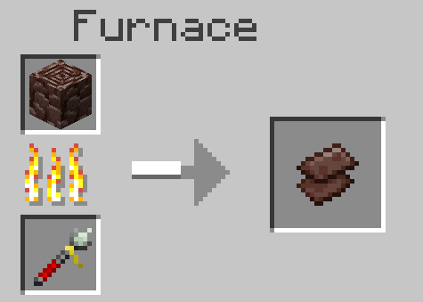

<h1>Ch's Trip and Magic 0.7.0 Update Release Note</h1>

<h2>New Features</h2>

Added level 3 Spellbooks.

Added Magic Level Up Core Lv.3.

Added level 3 magics.

Added Lighting Rapier.

<h3>New Magics are Available Now!</h3>
<h4>List of the added magics</h4>
<ul>
    <li>Keraut Llone</li>
    <li>Pyro Wave</li>
    <li>Glacies Wave</li>
    <li>Gust Burst</li>
    <li>Void Veil</li>
    <li>Water Vale</li>
</ul>

<h2>Changes</h2>

Reduced the flight time of Bolt Strike and Zephyr Blade.

Toned down Level 1 magic effects for better visibility.

Updated the Zephyr Blade's terrain hit effects and sounds.

Reduced the volume of Bolt Strike's hit sound.

Some terrain hit effects and sounds of all level 1 magics will now only play when hitting an entity.

Mana capacity and regeneration now scale with the player's highest reached XP level.

Reduced the max mana bonus from Magic Core [Add Mana capacity] (50 → 10).

The Japanese spelling of "Mana" was changed from English to Japanease.

<h2>Technical Changes</h2>

Changed the base item for all non-right-click items from Wooden Pickaxes to Diamond Pickaxes.

Note: These items can no longer be used as fuel in furnaces.

<h2>Fixed Bugs</h2>

Fixed an issue where Atter Raggio was incorrectly named Atterraggio.

Fixed an issue where mobs failed to be lanched when killed by the Atter Raggio.

Fixed an issue where mana regeneration particles were not appearing correctly.

Fixed an issue where Copper Lance required Netherite Ingot for repairs.

Fixed an issue in the Japanese translation where Magic Core's mana bonus was incorrectly labeled as "MP" instead of "マナ". Which means it should have been displayed as "Mana," but it was displayed as "MP"!

<h3>Other minor adjustments...!</h3>
